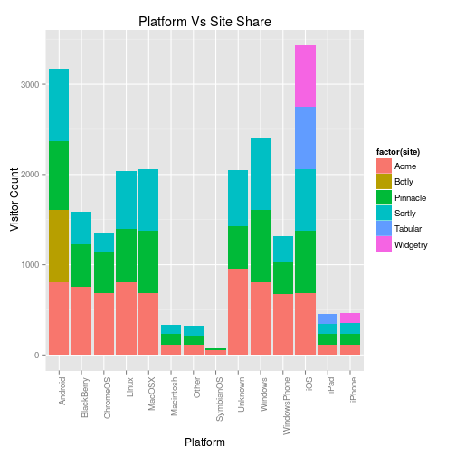
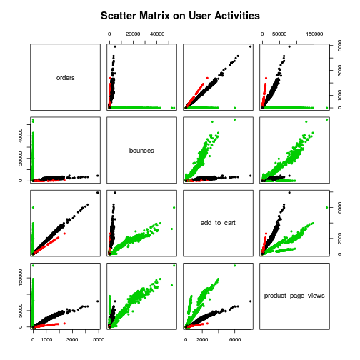

Report : Web-Analytics Insights
==============
```
Author : Abhishek Agrawal
Email-Id : akagrawa@ncsu.edu
Language : R [base, knitR, ggplot2]
```


Synopsis
=================

In this document, a brief report is presented which provide the insights about the **visitors behavior and activities** on the website. Now, before going deeper into any analytics, lets us discuss what is that we are trying to achieve. The answer is clear, i.e. "the website visitor's behavior and activities trends". But now the question is how these information can be retrieved and more importantly how can it **tell a story**.   
Well, for that we need a set of right questions that can capture our story. So, lets begin our story with a set of questions and answers.    
**Note:** This report is generated using KnitR package in R and the results are reproducible using the R packages. Code is embedded in the same file.

Question 1 : How is data loaded and how it looks like?
===========

Data is obtained from an ecommerce vendor as a dummy data of some of their actual data streams and saved in .csv format named **"webdata.csv"** . Wait!, do you want to see that.. Ok!, below is the code to load and peek into data.


```r
rm(list=ls())
webData <-  read.csv("webdata.csv", header = T) # Loading data
names(webData)
```

```
##  [1] "day"                "site"               "new_customer"      
##  [4] "platform"           "visits"             "distinct_sessions" 
##  [7] "orders"             "gross_sales"        "bounces"           
## [10] "add_to_cart"        "product_page_views" "search_page_views"
```

```r
head(webData,1)
```

```
##           day site new_customer platform visits distinct_sessions orders
## 1 1/1/13 0:00 Acme            1  Android     24                16     14
##   gross_sales bounces add_to_cart product_page_views search_page_views
## 1        1287       4          16                104               192
```

Well!, now you got an idea, that how the data looks likes and what are the attributes present in the data such as (day, site, visits, order, gross_sales, page_views etc.). 
Now lets move on to the next question.

Question 2 : Does the data looks clean and if not, any pre-processing or feature engineering is required?
======
Yes, the data looks mostly clean but it does have some missing values and some features can be created that can give us better insights later such as day, month etc. 
* So, in the first step lets see the summary statistics of the data: 


```r
summary(webData) # Summary statistics of the data
```

```
##             day              site       new_customer      platform   
##  12/19/13 0:00:   86   Acme    :7392   Min.   :0.000   iOS    :3435  
##  11/29/13 0:00:   85   Botly   : 804   1st Qu.:0.000   Android:3172  
##  12/11/13 0:00:   85   Pinnacle:5725   Median :0.000   Windows:2399  
##  12/7/13 0:00 :   85   Sortly  :5532   Mean   :0.448   MacOSX :2054  
##  12/2/13 0:00 :   84   Tabular : 804   3rd Qu.:1.000   Linux  :2036  
##  12/5/13 0:00 :   84   Widgetry: 804   Max.   :1.000   Unknown:1641  
##  (Other)      :20552                   NA's   :8259    (Other):6324  
##      visits       distinct_sessions     orders         gross_sales    
##  Min.   :     0   Min.   :     0    Min.   :   0.00   Min.   :     1  
##  1st Qu.:     3   1st Qu.:     2    1st Qu.:   0.00   1st Qu.:    79  
##  Median :    24   Median :    19    Median :   0.00   Median :   851  
##  Mean   :  1935   Mean   :  1515    Mean   :  62.38   Mean   : 16473  
##  3rd Qu.:   360   3rd Qu.:   274    3rd Qu.:   7.00   3rd Qu.:  3145  
##  Max.   :136057   Max.   :107104    Max.   :4916.00   Max.   :707642  
##                                                       NA's   :9576    
##     bounces         add_to_cart     product_page_views search_page_views
##  Min.   :    0.0   Min.   :   0.0   Min.   :     0     Min.   :     0   
##  1st Qu.:    0.0   1st Qu.:   0.0   1st Qu.:     3     1st Qu.:     4   
##  Median :    5.0   Median :   4.0   Median :    53     Median :    82   
##  Mean   :  743.3   Mean   : 166.3   Mean   :  4358     Mean   :  8584   
##  3rd Qu.:   97.0   3rd Qu.:  43.0   3rd Qu.:   708     3rd Qu.:  1229   
##  Max.   :54512.0   Max.   :7924.0   Max.   :187601     Max.   :506629   
## 
```

* Now, lets replace missing values in new_customer column as numeric value 2(nominal).

```r
# Assigning the customer having missing value as 2 
webData$new_customer[which(is.na(webData$new_customer))] <- 2  
# Similarly Assgning the missing value platform to Unknown
webData$platform[which(webData$platform == "")] <- "Unknown"  
webData$platform <- factor(webData$platform)
```

* Now in the final step, lets extract some date related fields from the data and append it in our main data.

```r
webData$date <- substring(webData$day, 0, 7)

webData$day <- weekdays(as.Date(webData$date, "%m/%d/%y"))
webData$day <- as.factor(webData$day)

webData$month <- months(as.Date(webData$date, "%m/%d/%y"))
webData$month <- as.factor(webData$month)
```
Ok, enough with boring codes. Now lets see something cool. Lets answer some real questions now.

Question 3 : Who visits the website and what they do?
======
Well from the data, it is clear that the users belong to the category of "New User", "Returning User" and "Neither". Lets segment them and observe their visits, Bounces, addtocart & orders trends. 


```r
library(ggplot2)
library(reshape2)
library(gridExtra)
```

```
## Loading required package: grid
```

```r
# Aggregaring data based on average visits, bounces, addtocart and orders group by user
getAggregate <- function(funcName){
    activity <- aggregate(list(webData$visits, webData$bounces, webData$add_to_cart, webData$orders), list(webData$new_customer), FUN=funcName)
    names(activity) <- c("Customers","Visits","Bounces","Add to Cart", "Order")
    activity <- activity[,-1]
}

activity <- getAggregate("mean")
Customers=c("New_User","Returning User","Neither")     # create list of names
data=data.frame(cbind(activity),Customers)   # combine them into a data frame
data.m <- melt(data, id.vars='Customers')

# Plotting Code
plot1 <- ggplot(data.m, aes(Customers, value)) + ggtitle("Customer Visit Pattern[On Average]") +  geom_bar(aes(fill = variable), position = "dodge", stat="identity") +ylab("Average Count") 

activity <- getAggregate("sum")
data=data.frame(cbind(activity),Customers)   # combine them into a data frame
data.m <- melt(data, id.vars='Customers')

plot2 <- ggplot(data.m, aes(Customers, value)) + ggtitle("Customer Visit Pattern [Total]") +geom_bar(aes(fill = variable), position = "dodge", stat="identity")  + ggtitle("Customer Visit Pattern[Log Scale]") + scale_y_log10("Total Count")

grid.arrange(plot1, plot2, nrow = 2)
```

 

Here, from both the panels, we can get the following perceptions: 
* 1. The "Neither" category of customer is exceptionally high from returning and new users. This means that the web-logs are failed to capture most of the user category or there are many bot visits on the website.
* 2. The Neither category users do not have any order count on average, which strengthen the claims of the bot-visits.
* 3. New-users are more than returning users. Well its both good and bad news for the website. Good news is they have a traffic of new customers joined this year means their business is not flop. And bad news is the returning users counts are less, this might indicate a slight customer un-satisfaction.
* 4. From the second plot, we can clearly have a zoomed glance of the visitors trends. Like, returning users have less bounce rate compare to new users. 
* 5. There is a similar add-to-cart to order conversion rate in returning and new users, unlike the "Neither" user category.  

Ok, Now lets, dig deeper into another set of trends. 

Question 4 Is there any temporal pattern in visitors behavior?
================================
We need to group the visits patterns based on day and month, to find out such pattern.

```r
activity <- aggregate(list(webData$visits, webData$bounces, webData$add_to_cart, webData$orders), list(webData$month), FUN="mean")
names(activity) <- c("Month","Visits","Bounces","Add to Cart", "Order")
activity <- activity[,-1]

Months=unique(webData$month)     # create list of names
data=data.frame(cbind(activity),Months)   # combine them into a data frame
data.m <- melt(data, id.vars='Months')
data.m$Months <- factor(data.m$Months, levels=c("January", "February", "June","July","August","September","October","November","December"))

plot3 <- ggplot(data.m, aes(x = Months, y = value)) + geom_line(size=1, aes(group=variable,color=factor(variable)))+geom_point(color="blue") +  ggtitle("Monthly Activity Trend") + theme(axis.text.x = element_text(angle = 90, hjust = 1)) + ylab("Average Count")

activity <- aggregate(list(webData$visits, webData$bounces, webData$add_to_cart, webData$orders), list(webData$day), FUN="mean")
names(activity) <- c("Days","Visits","Bounces","Add to Cart", "Order")
activity <- activity[,-1]

Days=unique(webData$day)     # create list of names
data=data.frame(cbind(activity),Days)   # combine them into a data frame
data.m <- melt(data, id.vars='Days')
data.m$Days <- factor(data.m$Days, levels=c("Monday", "Tuesday","Wednesday" ,"Thursday","Friday","Saturday","Sunday"))

plot4 <- ggplot(data.m, aes(x = Days, y = value)) + geom_line(size=1, aes(group=variable,color=factor(variable)))+geom_point(color="blue") +  ggtitle("Day-Wise Activity Trend") + theme(axis.text.x = element_text(angle = 90, hjust = 1)) + ylab("Average Count")

grid.arrange(plot3, plot4, nrow = 2)
```

 

Now lets see what all we can interpret from the above plots: 
* 1. We see some seasonal traffic in Februray and October, but again not so much significant.
* 2. Similar trends of activities are observed in month and day-wise views. 

**Note:** Since the data is dummy, we have not seen any of the real-world temporal patterns in this data, such as seasonal patterns or weekday-weekend patterns.

Ok, now lets see some other patterns.

Question 5: Is there any trend based on the user platform and the particular site visit?
======
To see that, lets check the share of each site on the platform wise visits of customers.


```r
qplot(factor(platform), data=webData, geom="bar", fill=factor(site))  + theme(axis.text.x = element_text(angle = 90, hjust = 1)) +xlab("Platform") +ylab("Visitor Count") + ggtitle("Platform Vs Site Share")
```

 
  
Few interpretations from the above plot :  
* 1. It is obvious and very clear that the website has dominant Android, IOS and windows users.
* 2. Acme, Pinnacle and Sortly sites are pre-dominantly visited and are opened in almost all the platforms.
* 3. Few Sites as "Botly", "Widgetry" and "Tabular" are not much popular in every platform. This means that these sites either do not have cross-platform support or they are very less popular. There is a scope of increasing customer base of these less popular sites among different platform users.
* 4. Symbian, Machintosh have very less customer base wrt to others, this indicates that the maintainance and new-feature development support of these platform can have less priority. 

Ok, now lets check some hidden patterns. Yes, I am talking about data-mining stuffs. 

Question 6 : Are there any natural clusters in the data, and if present what they indicates?
=====
Well, we can check the clustering using K-means and other clustering algorithms. But lets check some natural cluster using Exploratory Data Analysis itself.


```r
clustData <- subset(webData, select=c("new_customer","orders","bounces","add_to_cart","product_page_views"))

plot(clustData[,2:ncol(clustData)], pch=20, col=clustData$new_customer+1, main="Scatter Matrix on User Activities")
```

 
  
Now, lets see what the above plot means:
* 1. We can see some natural cluster in the data. In many of the panels, there are 3 clear clusters [ Red -> "New User", Black -> "Returning User", Green -> "Neither"]. 
* 2. These clusters are nothing but different user-categories. This means that we can easily segment customer-type with respect to their site visit and activity patterns.
* 3. Since the clusters are linearly separable, this indicates the predictive nature of customer behavior. These predictions can help in building targeted customer campaigns.


Other Patterns and Scope
======
Well, pattern finding in data is a never ending process. With more quality data and enriched techniques we can have more hidden knowledge unraveled.   
* Here also, if we have product visit information, we can check for "Association Rules" among the product. These results can help in building recommendation systems for the website.   
* Similarly user-signature data can help in analyzing individual customer behavior that can help in building personalized advertisements.
* Geo-spatial information can also provide more detail analysis of location wise customer behavior.  


End Of Report
==========
